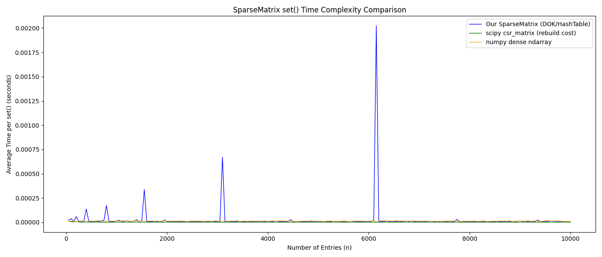
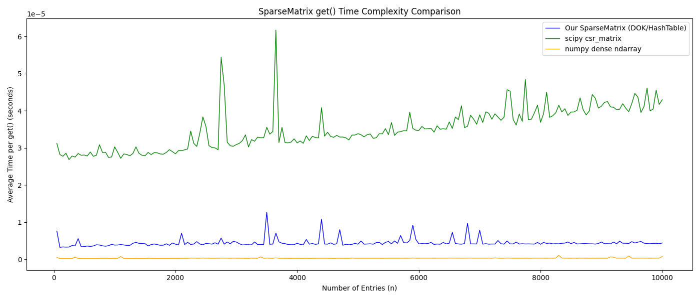
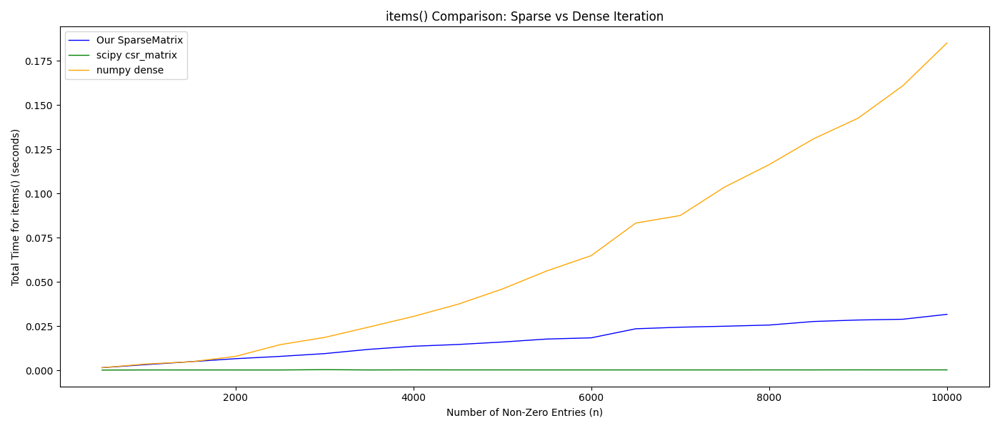
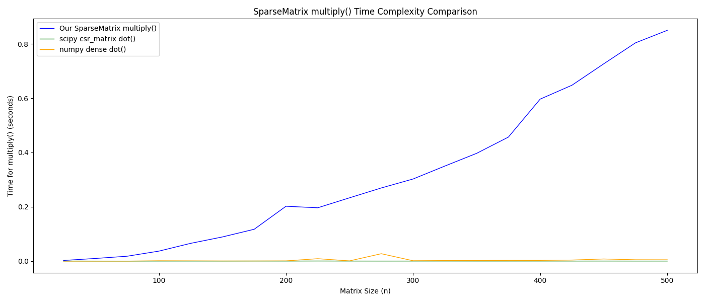
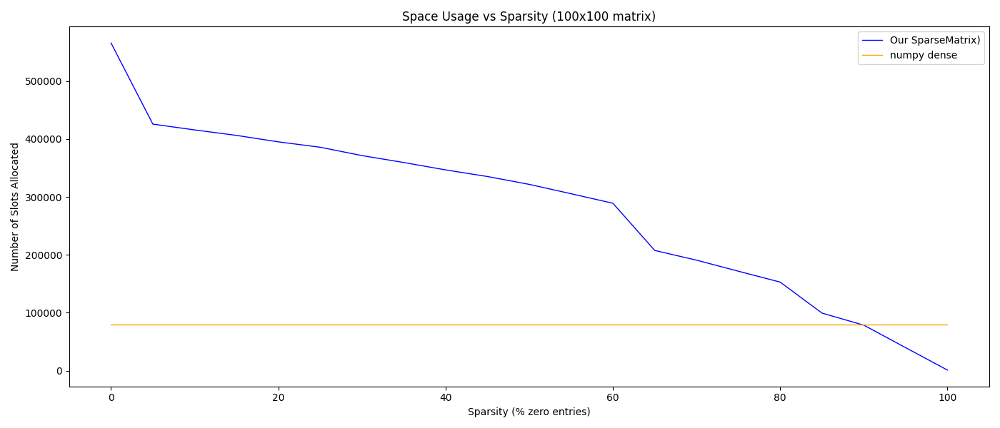

# Sparse Matrix Complexity Analysis

**Name:** Owen Ringrose\
**Date:** 4/9/2026 \
**Implementation:** DOK\
[DOK / COO / CSR — circle one]

---

## Overview
To implement my sparse matrix I chose to do a dictionary of keys. A dictionary of keys, DOK, approach has a hash map that keys values based off of the matrix coordinate.

 This implementation makes the most sense for a tilemap. This is because given a coordinate we have constant lookup and insert time. As we will see in our comparisons, CSR is worse for acsessing values being log(n) in complexity. Coordinate lists are even worse for lookups being O(n). CSR's really excel when it comes to multiplication and other operations but this isnt something you would have to do to a tilemap. 

Overall, the DOK implementation is simple enough to implement will also providing us instant gets and sets which is what we want for a tilemap.

---

## Time Complexity

Fill in the `?` cells after analysing your implementation.

| Operation | Your SparseMatrix | scipy sparse (CSR) | numpy dense |
|-----------|-------------------|--------------------|-------------|
| `set(r, c, v)` | O(1) | O(nnz) amortised | O(1) |
| `get(r, c)` | O(1) | O(log nnz) | O(1) |
| `items()` iteration | O(hash_cap + nnz) | O(nnz) | O(n²) |
| `multiply(other)` | O(nnz_a*columns_b) | O(nnz²/n) | O(n³) |

*nnz = number of non-zero entries, n = matrix dimension side length*

nnz_a is the non-zero entires of A in A * B, columns_b is the number of columns in matrix B

Hash_cap is the number of buckets in the underlying hashtable. 

For our SparseMatrix, set() and get() have a constant time as they are implemented using a hashtable. Assuming we hash effectively and resize often this should be average O(1).

items() has a complexity based off of the capacity of the underlying hash. This is because our items() function checks every bucket and then follows every linked list if it exists. Making its complexity the larger of the number of buckets or number of non zero elements.

multiply has an algorithmic complexity of nnz_a * columns_b. You can best see this in our code where we have the following nested for loop: 
```
for (row, col), value, in self.items():
            for k in range(other.cols):
                other_value = other.get(col, k)
                if other_value != other.default:
                    result_value = result.get(row,k)
                    result.set(row, k, result_value + value * other_value)
        
```
This makes our complexity O(nnz_a*columns_b). 
---

## Benchmark Results

# set coordinates:


As you can see we have with setting we have constant time except for where we have to rebuild our matrix to resize our hashtable. At this point it becomes o(nnz)

# get value:


Our representation has constant lookip time. The densematrix uses arrays which have closed form formulas for instant acsess making it very efficient. The CSR is the worst at log(nnz).

# items():

Both our sparse matrix and the scipy CSR are efficient in getting every item. The dense matrix on the otherhand takes O(n^2) which since it has to retrieve even values of 0.

# multiply

Our DOK implementation is the worst out of the three options. This stems from DOK's not being efficient for multiplication. This also is a product of our algorithm not being made the most efficient as this isnt something we would have to do for our tilemap

---

## Space Complexity

| Representation | Space Used |
|----------------|-----------|
| Dense n×n      | O(n²)     |
| Your sparse    | O(nnz)     |



This graph shows for a 100x100 matrix the space usage of our sparse matrix implementation vs a numpy dense matrix. We then see the space usage for different sparsity's. \From this we can see that the sparse matrix becomes less space efficient when the sparsity becomes lower than around 90%. While both have a worst case space efficiency of o(n^2) the sparse matrix implementation has a lot higher overhead per item.

---

## Observations

1. How does your implementation compare to scipy in terms of speed?\
Our sparse matrix implementation is either the same or slower than scipy's CSR implementation for everything except random acsess. This is however our primary use so this is desired. Scipy has faster multiplication and items(), and is similar in everything else.
2. When is a sparse representation faster than a dense one?
A sparse representation is faster than a dense one when we have a high sparsity. This is because as we have a lower sparsity our implementation becomes a worse matrix. This can be seen with things like getting every value (items()). Dense matrices always will be highly efficient for random acsess as they are implemented using arrays.
3. Was the overhead per entry (your structure vs. numpy array) noticeable?
Yes. At a low sparsity our structure uses over 5 times the amount of memory to hold the data. This is why a sparse matrix should only be used when we know we will have a high sparsity.

---

## Conclusions
Overall sparse data structures rely heavily on the matrix it is representing to be sparse to remain efficient. When you have high sparsity using a sparse matrix over a typical matrix can save you a lot of memor and time. Sparse matrices excel in saving space while keeping lookup times fast. For sparse matrices, especially the CSR implementation, we also can perform mathematical operations such as multiplication extremly quickly on sparse matrices.

---

## References

https://en.wikipedia.org/wiki/Sparse_matrix

